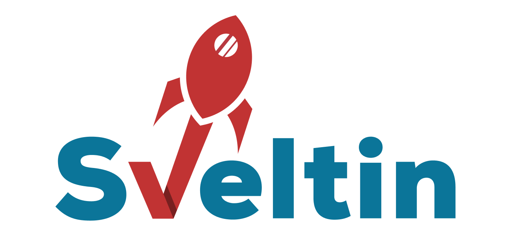

<h1 align="center">
    
</h1>
<h2 align="center">
The Smartest Way to Build SvelteKit powered static websites.
</h2>
<p align="center">
    <a href="https://github.com/sveltinio/sveltin/actions/workflows/release.yml" target="_blank">
        
    </a>
    &nbsp;
    <a href="https://github.com/sveltinio/sveltin/releases" target="_blank">
        
    </a>
    &nbsp;
    <a href="https://github.com/sveltinio/sveltin/blob/main/LICENSE" target="_blank">
        
    </a>
</p>

# Sveltin

Sveltin is a CLI (Command Line Interface) created to boost the developers productivity working on <strong>SvelteKit powered static websites.</strong>

## :warning: Project Status

> Sveltin is under active development following the progress toward SvelteKit v1.0. Please, give it a try and let it evolve. If you are interesting on it please, see the **Contributing** section.

## :mega: Overview

Sveltin is a simple, quick and powerful CLI to:

- Scaffold SvelteKit powered websites
- Generate resources, libs and endpoints
- Add content to the resources
- Generate menu structure, sitemap and rss
- Make your site SEO Ready (Metadata, Json-LD, OpenGraph) in a easy way

Sveltin provides:

- Out-of-the-box support for vanilla CSS, Sass/SCSS, TailwindCSS, Bulma and Bootstrap
- Ready to use Svelte components

## :rocket: Quick Start

With few commands Sveltin flex the muscles 💪

```bash
# Create a project with TailwindCSS support
sveltin new myBlog --css tailwindcss

# Move to the project folder
cd myBlog

# Install all the dependencies
sveltin prepare

# Create a public page as Svelte component
# (http://localhost:3000/contact)
sveltin new page contact --type svelte

# Create a 'posts' resource
sveltin new resource posts

# Add new content to the posts resource
# (http://localhost:3000/posts/getting-started)
sveltin new content posts/getting-started

# Add a 'category' metadata
# (http://localhost:3000/posts/category)
sveltin new metadata category --resource posts --type single

# Run the server
sveltin server
```

## :book: Documentation

Please see the [documentation](https://docs.sveltin.io) for more information about Sveltin.

## :computer: Installation

### :wrench: Prerequisites

- Git
- Node (v16.9.0 or higher is required)

### OSX and Linux via Homebrew

Homebrew will also install Git and Node.

```bash
# Tap a new formula:
brew tap sveltinio/sveltin

# Install:
brew install sveltin
```

### Windows via Scoop

```bash
# Tap a new bucket:
scoop bucket add sveltinio https://github.com/sveltinio/scoop-sveltin.git

# Install:
scoop install sveltinio/sveltin
```

### Go Install

Installation is done by using the `go install` command. In this case, ensure to have **Go (v1.17 or higher) installed** on your machine:

```bash
go install github.com/sveltinio/sveltin@latest
```

### Manually

You can download the pre-compiled binary for you specific OS from the [releases page](https://github.com/sveltinio/sveltin/releases). You will need to copy the and extract the binary, then move it to your local bin folder. Please, refer to the example below:

```bash
curl https://github.com/sveltinio/sveltin/releases/download/${VERSION}/${PACKAGE_NAME} -o ${PACKAGE_NAME}
sudo tar -xvf ${PACKAGE_NAME} -C /usr/local/bin/
sudo chmod +x /usr/local/bin/sveltin
```

## :gear: CLI Commands & Options

```bash
$ sveltin -h

sveltin is the main command to work with SvelteKit powered static website.

Usage:
  sveltin [command]

Available Commands:
  build        Builds a production version of your static website
  generate     Command to generate static files like sitemap, rss etc
  help         Help about any command
  new          Command to create projects, resources, contents, pages and metadata
  prepare      Install all the dependencies from the package.json file
  preview      Preview the production version locally
  server       Run the server
  update       Update all the dependencies from the package.json file

Flags:
  -h, --help      help for sveltin
  -v, --version   version for sveltin

Use "sveltin [command] --help" for more information about a command.
```

sveltin comes with a set of commands and subcommands to help dealing with your SvelteKit project.

Each command can be executed with inline arguments or interactivly.

### sveltin new

`sveltin new` is the main command to generate both the project and the artifacts for your website.

Alias: `create`

<details>
    <summary>(Click to expand the list of avilable subcommands)</summary>

| Subcommand |   Aliases    | Description                                                   |
| :--------- | :----------: | :------------------------------------------------------------ |
| [resource] |      r       | Create new resources.                                         |
| [content]  |      c       | Create a new content for existing resource.                   |
| [metadata] | m, groupedBy | Add a new metadata from your content as a Sveltekit resource. |
| [page]     |      p       | Create a new public page.                                     |

</details>

Read more [here][new].

### sveltin generate

`sveltin generate` is used to generate static files like sitemap, menu structure or rss feed file.

Alias: `g`, `gen`

<details>
    <summary>(Click to expand the list of avilable subcommands)</summary>

| Subcommand | Description                                             |
| :--------- | :------------------------------------------------------ |
| [menu]     | Generate the menu config file for your Sveltin project. |
| [sitemap]  | Generate a sitemap.xml file for your Sveltin project.   |
| [rss]      | Generate a rss.xml file for your Sveltin project.       |

</details>

Read more [here][generate].

### sveltin prepare

`sveltin prepare` is used to initialize the Sveltin project getting all depencencies from the `package.json` file.

Alias: `i`, `install`, `init`

Read more [here][prepare].

### sveltin update

`sveltin update` is used to update all depencencies from the `package.json` file.

Alias: `u`

Read more [here][update].

### sveltin server

`sveltin server` is used to run the VITE server. It wraps svelte-kit defined commands to run the server.

Alias: `s`, `serve`

Read more [here][server].

### sveltin build

`sveltin build` is used to build a production version of your static website. It wraps `sveltekit-build` command.

Alias: `b`

Read more [here][build].

### sveltin preview

`sveltin preview` is used to run a preview for the production version locally.

Read more [here][preview].

## :bulb: Contributing

Contribution of any kind including documentation, themes, tutorials, blog posts, bug reports, issues, feature requests, feature implementations, pull requests are more than welcome.

Read more [here][contributing].

## :free: License

Sveltin is free and open-source software licensed under the Apache 2.0 License.

[new]: https://docs.sveltin.io/cli/new
[resource]: https://docs.sveltin.io/cli/new-resource
[content]: https://docs.sveltin.io/cli/new-content
[metadata]: https://docs.sveltin.io/cli/new-metadata
[page]: https://docs.sveltin.io/cli/new-page
[generate]: https://docs.sveltin.io/cli/generate
[menu]: https://docs.sveltin.io/cli/generate-menu
[sitemap]: https://docs.sveltin.io/cli/generate-sitemap
[rss]: https://docs.sveltin.io/cli/generate-rss
[server]: https://docs.sveltin.io/cli/server
[prepare]: https://docs.sveltin.io/cli/prepare
[update]: https://docs.sveltin.io/cli/update
[build]: https://docs.sveltin.io/cli/build
[preview]: https://docs.sveltin.io/cli/preview
[contributing]: CONTRIBUTING.md
